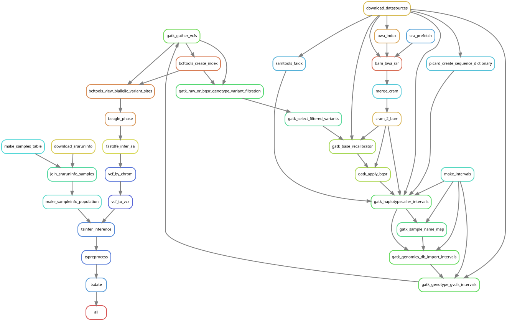

# vcarg

Snakemake workflow to run tree sequence inference on a Bioproject ID
in the European Nucleotide Archive. Given a Bioproject ID the workflow
will download Sequence Read Archive (SRA) run info, merge with
user-provided sample metadata, and run GATK best practice variant
calling followed by tree sequence inference with tsinfer+tsdate.

## Quickstart

Clone the repo `vcarg` from `github`:

    git clone https://github.com/percyfal/vcarg

and initialize `pixi` environments with

    pixi install -a

The `pixi` Manifest `pixi.toml` defines a number of tasks to get you
started. To get an idea of what the workflow does, run

    pixi run dry

## Bioproject PRJNA549183 - Monkeyflower species complex

The repo contains example configuration files and scripts to run the
workflow on bioproject PRJNA549183, a speciation genomic study of the
*Diplacus aurantiacus* (monkeyflower) species complex (Stankowski et
al, 2019). To launch the full workflow run

    pixi run full

but beware that this will require several thousand CPU hours.

### Test run

As an alternative there is a configuration that runs the workflow on a
subset of samples, and for one linkage group
(LG4:11,000,000-14,000,000). Note that the mapping is done to the full
reference sequence but only mappings to the selected region are kept.

    pixi run test

## Workflow rulegraph

<!-- markdownlint-disable MD013 MD033 -->

|  |
|:--------------------------------------------------------------------------------------:|
| Vcarg Snakemake rulegraph                                                              |

<!-- markdownlint-enable MD013 MD033 -->

## References

- Stankowski, S., Chase, M. A., Fuiten, A. M., Rodrigues, M. F.,
  Ralph, P. L., & Streisfeld, M. A. (2019). Widespread selection and
  gene flow shape the genomic landscape during a radiation of
  monkeyflowers. PLOS Biology, 17(7), 3000391.
  <http://dx.doi.org/10.1371/journal.pbio.3000391>
